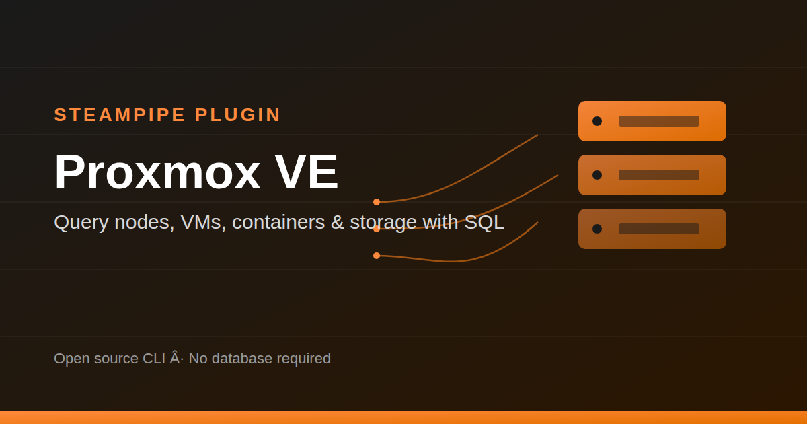

# Steampipe Plugin: Proxmox

<p align="center">
  
</p>

[](https://hub.steampipe.io/plugins/becash143/proxmox)
[](https://steampipe.io/community/join)

Use SQL to query your Proxmox VE cluster — nodes, virtual machines, LXC
containers, storage, networking, tasks, users, and resource pools.

[Steampipe](https://steampipe.io) is an open source CLI that exposes APIs
and services as a high-performance relational database, giving you the
ability to write SQL-based queries to explore dynamic data. This plugin adds
Proxmox VE as a queryable data source.

- **[Get started →](#quick-start)**
- Documentation: [Table definitions & examples](#tables)
- Community: [Join #steampipe on Slack →](https://steampipe.io/community/join)
- Get involved: [Issues](https://github.com/becash143/steampipe-plugin-proxmox/issues)

## Quick start

Install the plugin with Steampipe:

```bash
steampipe plugin install becash143/proxmox
```

<!--
  This form works once the plugin is listed on the Steampipe Hub. Until then,
  keep installing from the published GitHub release instead:
  steampipe plugin install ghcr.io/becash143/proxmox
-->

Configure your credentials in `~/.steampipe/config/proxmox.spc`:

```hcl
connection "proxmox" {
  plugin     = "becash143/proxmox"
  endpoint   = "https://your-proxmox-host:8006"
  api_token  = "user@realm!tokenid"     # e.g. "bikash@pve!inventory"
  api_secret = "your-token-secret"
  insecure   = true                     # set false if using a trusted/valid TLS certificate
}
```

Create an API token in the Proxmox web UI under
**Datacenter → Permissions → API Tokens**. For a read-only inventory tool
like this plugin, assign the token the **PVEAuditor** role at path `/`, and
make sure **Privilege Separation** is unchecked (or an explicit role is
granted) so the token can see VMs, containers, and other resources — not
just nodes.

Run a query:

```bash
steampipe query
> select storage, node, type, is_shared, used, total from proxmox_storage;
```

### Connection arguments

| Argument     | Type   | Required | Description                                                            |
|--------------|--------|----------|--------------------------------------------------------------------------|
| `endpoint`   | string | Yes      | Base URL of your Proxmox API, e.g. `https://proxmox.example.com:8006`   |
| `api_token`  | string | Yes      | API token ID in `user@realm!tokenid` format                             |
| `api_secret` | string | Yes      | API token secret                                                        |
| `insecure`   | bool   | No       | Skip TLS certificate verification. Defaults to `false`.                 |

## Documentation

- **[Sample query results](./sample-query-results)** — real output captured
  against a live, multi-node cluster, useful when you don't have one handy
  to test against locally.

### Tables

| Table                      | Description                                                             |
|-----------------------------|---------------------------------------------------------------------------|
| `proxmox_node`               | Physical nodes in the Proxmox cluster                                     |
| `proxmox_vm`                  | QEMU virtual machines across all nodes                                     |
| `proxmox_container`           | LXC containers across all nodes                                             |
| `proxmox_cluster_resource`    | Unified view of nodes, VMs, containers, storage, and pools in one call      |
| `proxmox_storage`             | Configured storage pools and their usage                                     |
| `proxmox_network`             | Network interfaces on each node                                               |
| `proxmox_task`                | Recent task/job history per node                                               |
| `proxmox_user`                | Proxmox access-control users                                                     |
| `proxmox_pool`                | Resource pools                                                                    |

### Example queries

**All running VMs, sorted by memory usage:**
```sql
select
  name,
  node,
  status,
  mem,
  maxmem
from
  proxmox_vm
where
  status = 'running'
order by
  mem desc;
```

**VM and container count per node:**
```sql
select
  node,
  count(*) filter (where type = 'qemu') as vms,
  count(*) filter (where type = 'lxc') as containers
from
  proxmox_cluster_resource
where
  type in ('qemu', 'lxc')
group by
  node;
```

**Storage pools nearing capacity:**
```sql
select
  storage,
  type,
  used,
  total,
  round((used::numeric / nullif(total, 0)) * 100, 1) as percent_used
from
  proxmox_storage
where
  total > 0
order by
  percent_used desc;
```

**Failed tasks in the last day:**
```sql
select
  node,
  type,
  user,
  status,
  to_timestamp(start_time) as started_at
from
  proxmox_task
where
  status != 'OK'
  and start_time > extract(epoch from now() - interval '1 day')
order by
  start_time desc;
```

## Developing

If you want to help develop the plugin, here's how to build and install a
local copy.

**Prerequisites**

- [Go](https://go.dev) 1.26+
- [Steampipe CLI](https://steampipe.io/downloads)

**Clone**

```bash
git clone https://github.com/becash143/steampipe-plugin-proxmox.git
cd steampipe-plugin-proxmox
```

**Build and install**

```bash
make
```

<!--
  Replace with your actual Makefile target if it differs (e.g. `make install`
  or `make dev`). This should build the plugin binary and copy it into
  ~/.steampipe/plugins/local/proxmox/steampipe-plugin-proxmox.plugin, i.e.
  automate what used to be these manual steps:

    go build -o steampipe-plugin-proxmox.plugin .
    mkdir -p ~/.steampipe/plugins/local/proxmox
    cp steampipe-plugin-proxmox.plugin ~/.steampipe/plugins/local/proxmox/steampipe-plugin-proxmox.plugin
    chmod +x ~/.steampipe/plugins/local/proxmox/steampipe-plugin-proxmox.plugin

  If there's no Makefile yet, keep the manual steps above instead — a
  Makefile with an `install` target that mirrors them is a good addition.
-->

When installed locally, reference the plugin as `local/proxmox` in your
connection config:

```hcl
connection "proxmox" {
  plugin = "local/proxmox"
  # ...
}
```

Restart the Steampipe service and query away:

```bash
steampipe query
> .inspect proxmox
```

## Contributing

Contributions are welcome! Please read the
[contribution guidelines](./CONTRIBUTING.md) before opening a PR.

1. Fork the repo
2. Create a feature branch
3. Make your changes, with tests/sample queries where relevant
4. Open a PR against `main`, referencing any related issue (e.g. `Fixes #12`)

## Get involved

- Source code: [github.com/becash143/steampipe-plugin-proxmox](https://github.com/becash143/steampipe-plugin-proxmox)
- Steampipe: [steampipe.io](https://steampipe.io)
- Issues and feature requests: open a GitHub issue on this repo

## License

Apache License 2.0
