# Sample Query Results

This folder contains sample output captured against a live, multi-node Proxmox VE
cluster using the `proxmox` Steampipe plugin. We don't have a cluster with
substantial data available in CI, so these screenshots document the actual shape
of the data (columns, types, and edge cases like null `end_time` on running
tasks, and how shared storage appears across nodes).

Each screenshot is paired with the exact query used to produce it.

---

## Table discovery

List every table exposed by the plugin:

```sql
select table_name
from information_schema.tables
where table_name like 'proxmox_%'
order by table_name;
```

Generate a `select * ... limit 3;` statement for each table automatically:

```sql
select
  'select * from ' || table_name || ' limit 3;' as query_to_run
from information_schema.tables
where table_name like 'proxmox_%'
order by table_name;
```

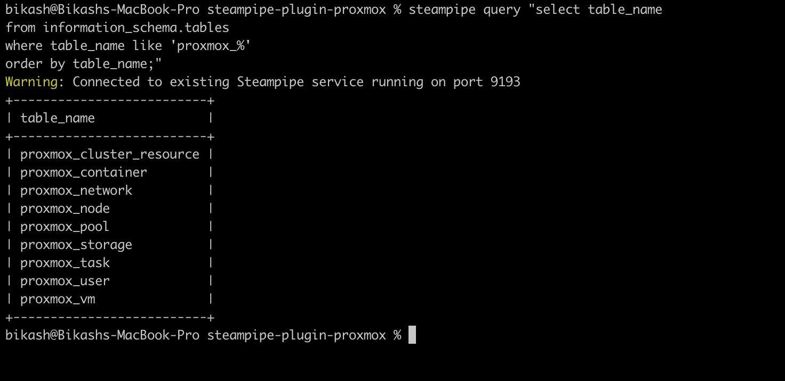
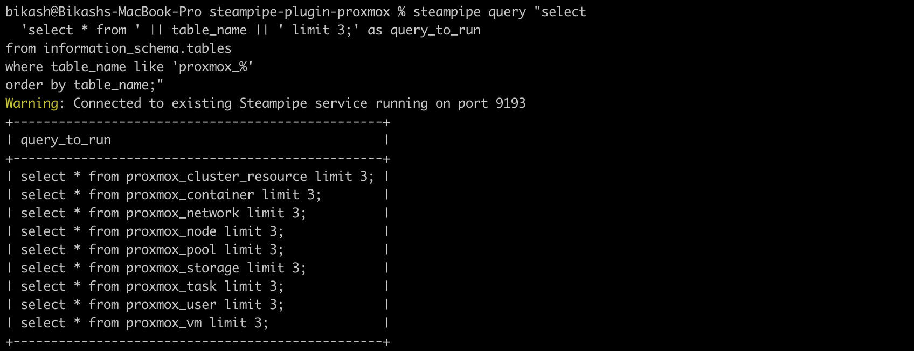
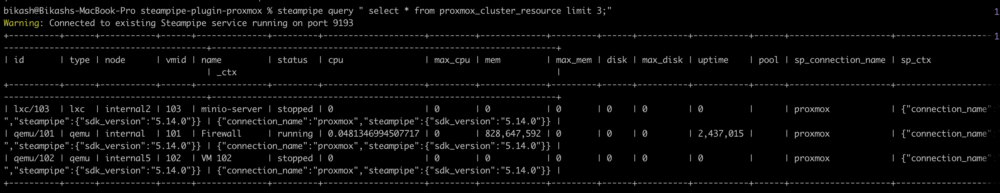
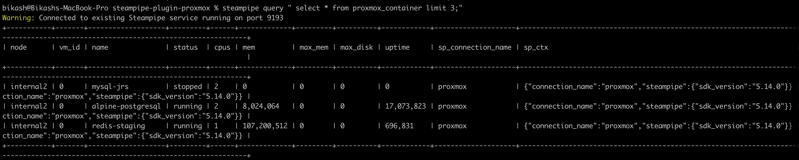
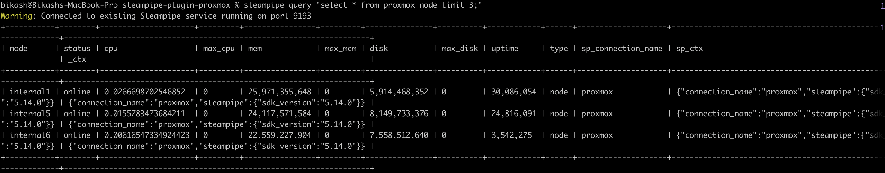

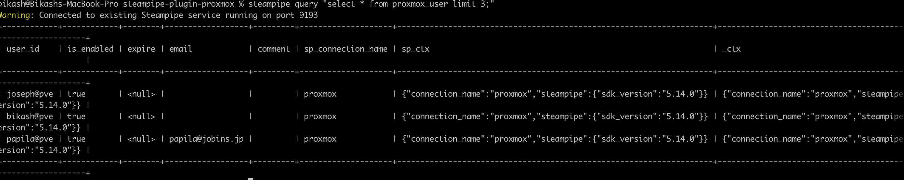
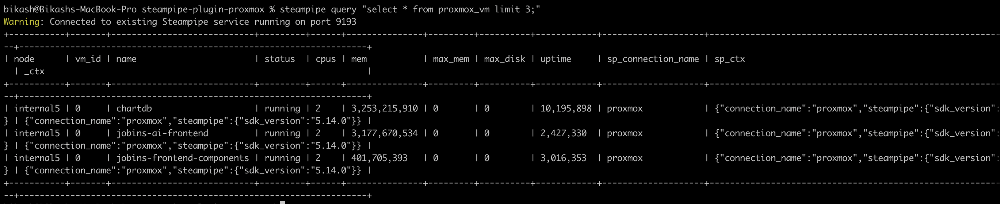
---

## Sample rows per table

```sql
select * from proxmox_task limit 3;
select * from proxmox_storage limit 3;
select * from proxmox_node limit 3;
select * from proxmox_vm limit 3;
select * from proxmox_container limit 3;
-- repeat for any other proxmox_* table returned above
```


---

## proxmox_task — timestamp fix verification

Confirms `end_time` is returned as `null` (not a zero-epoch or malformed value)
for tasks that are still running.

```sql
select node, up_id, type, status, start_time, end_time
from proxmox_task
order by start_time desc
limit 5;
```

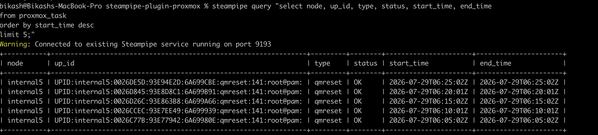
Companion query to guarantee at least one running task is captured, even if it
wouldn't otherwise appear in the first 5 most-recent rows:

```sql
select node, up_id, type, status, start_time, end_time
from proxmox_task
where end_time is null
limit 3;
```
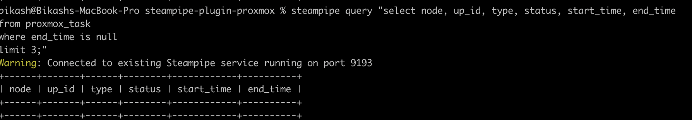

---

## proxmox_storage — column discovery

The initial query assumed a `shared` boolean column, which does not exist.
Actual columns, confirmed via:

```sql
select column_name, data_type
from information_schema.columns
where table_name = 'proxmox_storage'
order by ordinal_position;
```

(equivalently, `.inspect proxmox_storage` in the Steampipe CLI)

| column_name        | data_type |
|---------------------|-----------|
| storage             | text      |
| node                | text      |
| type                | text      |
| content             | text      |
| is_active           | boolean   |
| used                | bigint    |
| avail               | bigint    |
| total               | bigint    |
| is_shared           | boolean   |
| sp_connection_name  | text      |
| sp_ctx              | jsonb     |
| _ctx                | jsonb     |

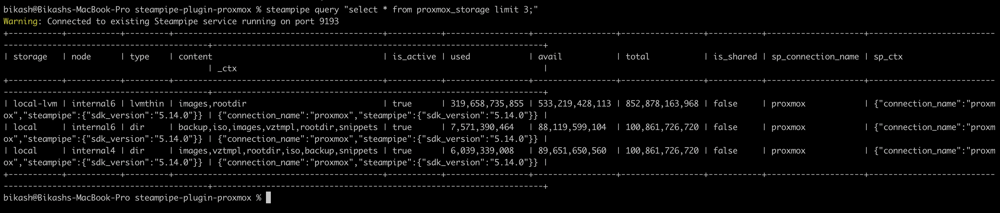

---

## proxmox_storage — shared storage across nodes

Corrected query using `is_shared`:

```sql
select storage, node, type, is_shared, used, total
from proxmox_storage
order by storage, node;
```

Narrowed to shared storages only, to clearly show the same `storage` value
repeating once per node it's mounted on:

```sql
select storage, node, type, is_shared, used, total
from proxmox_storage
where is_shared = true
order by storage, node;
```

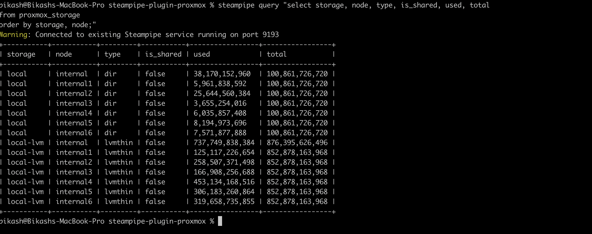

**Observed behavior:** _(fill in after reviewing the screenshot — note whether
`used`/`total` are consistent across nodes for the same shared storage, or
reported per-node.)_

---

## Notes

- Screenshots were taken against Steampipe CLI output (`.inspect` /
  `select ...`), connected via `steampipe query` against a live cluster.
- Node hostnames, IPs, VM names, and storage IDs have been redacted/cropped
  where they could expose internal infrastructure details.
- These are point-in-time captures for documentation purposes, not automated
  test fixtures. If regression testing is needed later, consider exporting
  the same queries as `.json`/`.csv` alongside the PNGs.
